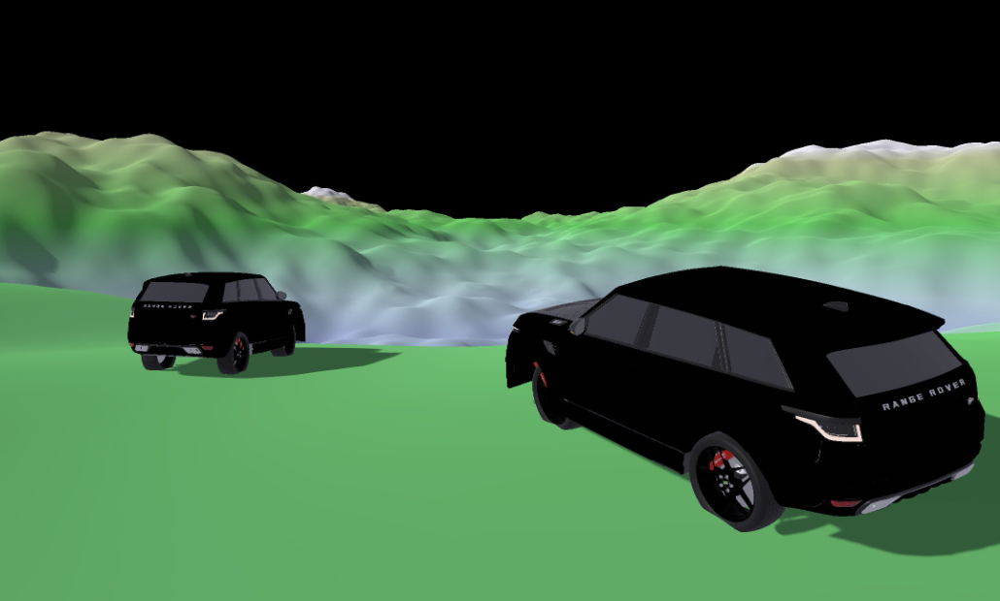

<h1 align="center">Driver's Altitude</h1>

<h3>A free, open-source, and realistic car simulation.</h3>

This program allows the user to control up to two cars and drive them around on randomly generated terrain using their keyboard and mouse, or a console controller! There are already many wonderful vehicle-driving programs out in the world already, but for someone with an interest in vehicles that doesn't want to commit to having to spend money, this program can be a great alternative.​

This program is great for allowing the user to see how a car handles bumpy terrain, going uphill, downhill, or on flat ground in the various valleys and peaks found in the simulated world.​

With many adjustable parameters prebuilt into the program and an open-source codebase, this project allows easy modding support for developers, and fully customizable mechanics for advanced users.

<h2 align="center">What makes this program great?</h2>

With many adjustable parameters prebuilt into the program and an open-source codebase, this project allows easy modding support for developers, and fully customizable mechanics for advanced users.

The Bevy game engine performs really well because of its ability to automatically parallelize and cache where it can. It has the fastest ECS (entity component system) according to some benchmarks.

<h2 align="center">How to run the application</h2>

Download the .exe file and run it. 
`[We don't have a build yet, but we will put a link to download it when our Release Candidate 2 is finished.]`

Alternatively, you can pull the project off our github repository. The instructions can be found [here](https://github.com/StanleyCHale/Capstone-Vehicle-Sim-Project-Team3/blob/main/src/project-info.md).

<h2 align="center">Help</h2>

Documentation can be found on our github. You can also open an issue on our [repository](https://github.com/StanleyCHale/Capstone-Vehicle-Sim-Project-Team3/tree/main).

Alternatively, you could contact us by our emails [down below](##aboutus).

<h2 align="center">About Us</h2>
Members:
- Stanley Hale - halesta@oregonstate.edu
  - UI, sound design, car model
- Ezra McDonald-Muelle - mcdonaez@oregonstate.edu
  - Terrain, skybox
- Greggory Hickman​ - hickmang@oregonstate.edu
  - Multiple car functionality, UI
- Benny Xu - xube@oregonstate.edu
  - Terrain, shaders

Project Partner:
- Christopher Patton 
  - Dynamics and Simulation Engineer at Patton Dynamics LLC
